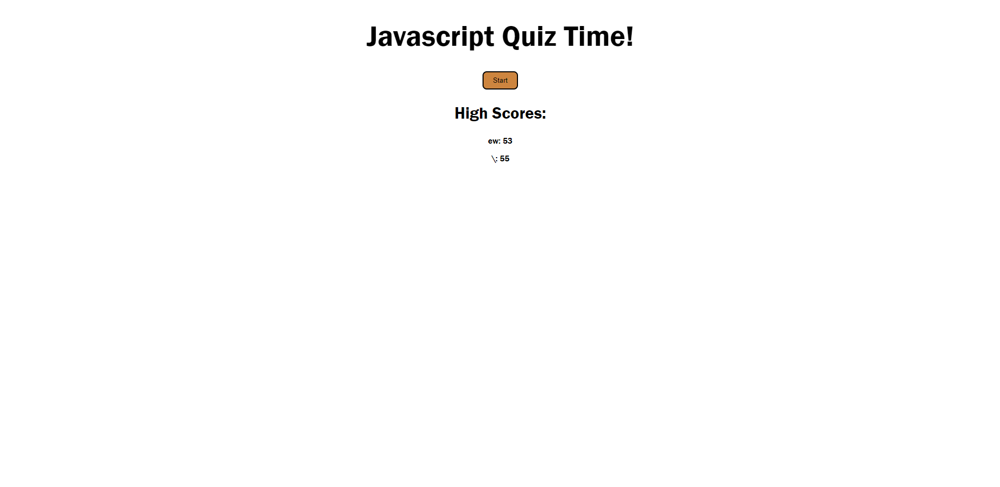

# Javascript Quiz

## Description

This is a quiz on Javascript that lets you track high-scores.

## Visuals

This is the website layout:

## Link

[nanea808.github.io/04-web-api-challenge/](https://nanea808.github.io/04-web-api-challenge/)

## Installation

N/A

## Usage

Step 1: Click "Start" button to beguin quiz.

Step 2: Answer all questions before the timer runs out!

Step 3: Enter your initals to save a highscore.

## Credits

N/A

## License

Please refer to the LICENSE in the repo.
